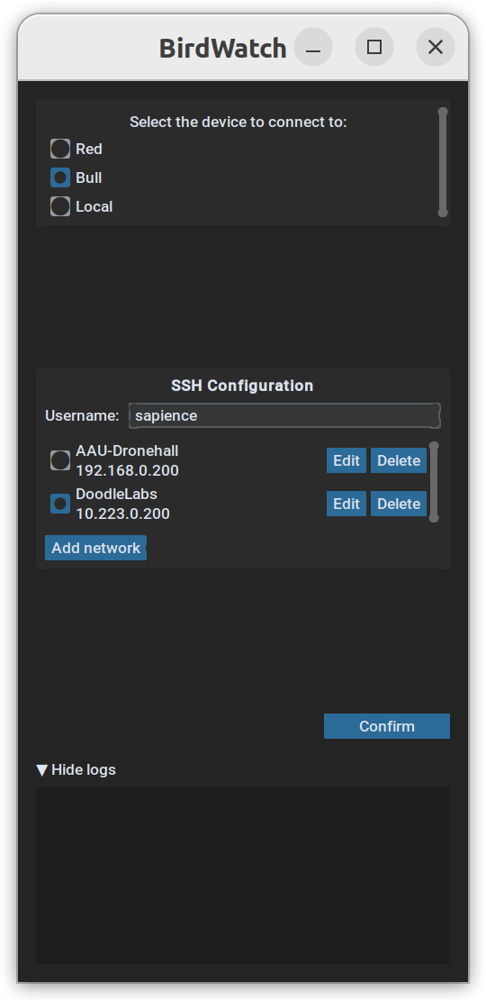
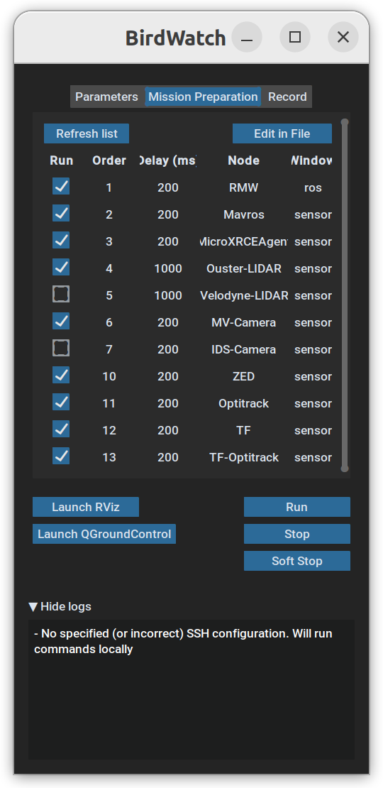
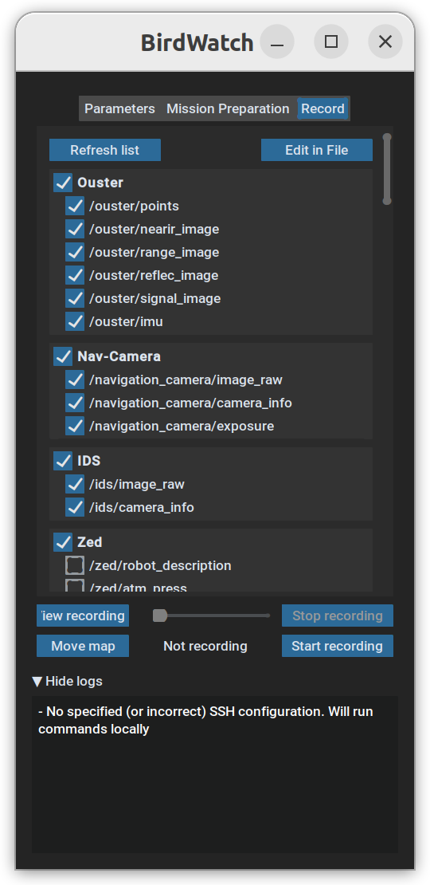

# BirdWatch

[](./LICENSE)

<p align="center">
  <br>
  
  
  
</p>

Graphical User Interface for remote monitoring and top-level control of UAVs.

Author: 

- [Felipe Estévez](https://www.linkedin.com/in/felipe-estevez/) 

Maintainers: 

- [Gilbert Tanner](mailto:gilberttanner.contact@gmail.com)
- [Luca Di Pierno](mailto:luca.dipierni@aau.at)

## Credit

This code was written by the [Control of Networked System (CNS) Group](https://sst.aau.at/cns), University of Klagenfurt, Klagenfurt, Austria.

## License
This software is made available to the public to use (_source-available_), licensed under the terms of the BSD-2-Clause-License with no commercial use allowed, the full terms of which are made available in the `LICENSE` file. No license in patents is granted.

## Table of Contents

- [Credit](#credit)
- [License](#license)
- [Dependencies](#dependencies)
- [Requirements](#requirements)
- [Installing](#installing)
    - [Parameters](#parameters)
- [Minimal Configuration Needed](#minimal-configuration-needed)
    - [Target Device](#target-device)
    - [Tmux](#tmux)
- [Manual](#manual)
- [Troubleshooting](#troubleshooting)
    - [Incompatibility with RQT](#incompatibility-with-rqt)


## Dependencies
All dependencies are listed [requirements.txt](requirements.txt)
- [CustomTkinter](https://github.com/TomSchimansky/CustomTkinter/tree/master) python UI-library based on Tkinter
- [Paramiko](https://www.paramiko.org/) provides high-level functionality to establish and manage SSH connections
- [PyYAML](https://pyyaml.org/) full-featured YAML framework for the Python programming language
- [Typing Extensions](https://pypi.org/project/typing-extensions/) complements the standard-library typing module by providing runtime support for type hints

## Requirements
- [tmux](https://github.com/tmux/tmux/wiki) terminal multiplexer installed in the target device

## Installing

Clone the repository
```sh
git clone https://github.com/aau-cns/birdwatch.git
```

Navigate to the repository and install the package
```sh
cd <path-to-repo>
pip3 install -e .
```

Launch from anywhere as (provided the [minimal configuration](#minimal-configuration-needed) has been performed)

Run via Python
```sh
birdwatch
```

### Parameters


Column A | Column B 
---------|----------
 `-t` or `--target_device` | Allows to skip the target device selection, trying to connect directly to the specified device. The list of available devices is given by the .yaml files in `config/target_devices`
 `-n` or `--network_name` | [not yet implemented] Provided the target device has also been provided, it allows to connect to the selected network instead of the last used. The list of available networks is defined in the configuration file for each target device under `config/target_devices`

## Minimal Configuration Needed

### Target Device

At least one target device needs to be specified (the file `config/target_devices/Template.yaml` can be used as a template). The repository includes the file `config/target_devices/Local.yaml` which allows to run BirdWatch without connecting to any remote device but rather run everything locally (this file should work out-of-the-box). Further explanation on target device configuration files can be found in [here](target-device-config.md)

### Tmux

To run ROS nodes, BirdWatch opens a tmux session with several windows and panes. In order for it to work it expects a certain tmux configuration. There should be a `.tmux.conf` in the home directory of the target device including the lines:
```sh
# Set first window and pane to index 1 (instead of default 0) for more
# direct mapping to keyboard
set-option -g base-index 1
set-window-option -g pane-base-index 1
```

## Manual
- [Target Device Configuration](documentation/target-device-config.md)
    - [Nodes File](documentation/nodes-file.md)
    - [Topics File](documentation/topics-file.md)
    - [Parameter Files](documentation/parameter-files.md)
- [Common Configuration](documentation/common-config.md)
- [RViz Configuration](documentation/rviz-config.md)

## Troubleshooting

### Incompatibility with RQT

It is possible that an incompatibility with RQT occurs, displaying the following message (or similar) when trying to open a bag file that contains images:
```
RosPluginProvider.load(rqt_bag_plugins/BagImagePlugin) exception raised in __builtin__.__import__(rqt_bag_plugins.image_plugin, [ImagePlugin]):
Traceback (most recent call last):
  File "/opt/ros/noetic/lib/python3/dist-packages/rqt_gui/ros_plugin_provider.py", line 79, in load
    module = __builtin__.__import__(
  File "/opt/ros/noetic/lib/python3/dist-packages/rqt_bag_plugins/image_plugin.py", line 35, in <module>
    from .image_timeline_renderer import ImageTimelineRenderer
  File "/opt/ros/noetic/lib/python3/dist-packages/rqt_bag_plugins/image_timeline_renderer.py", line 45, in <module>
    from PIL.ImageQt import ImageQt
ImportError: cannot import name 'ImageQt' from 'PIL.ImageQt' (/home/lda/.local/lib/python3.8/site-packages/PIL/ImageQt.py)
```

This is caused by using different version of the Pillow library. To solve this, first make sure you have the version of Pillow RQT uses (7.0.0):
```shell
pip uninstall Pillow
pip install Pillow==7.0.0
```

Then, install the module from Pillow that BirdWatch uses that doesn't come by default in version 7.0.0:
```shell
sudo apt-get install python3-pil.imagetk
```